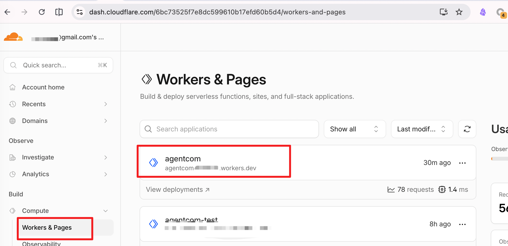
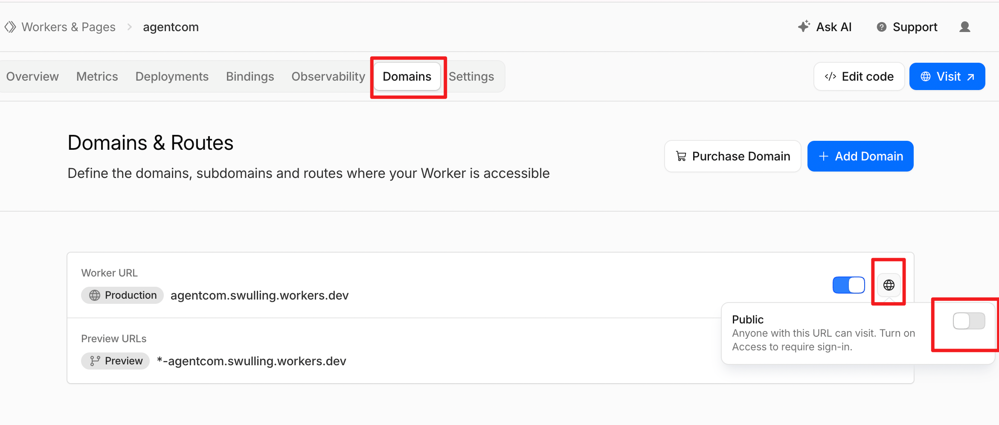
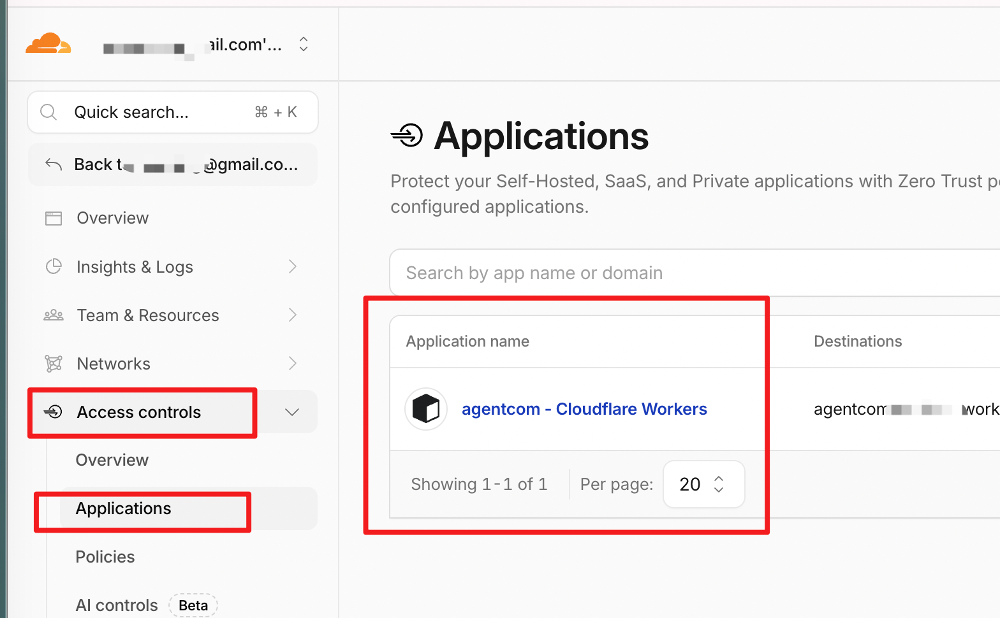
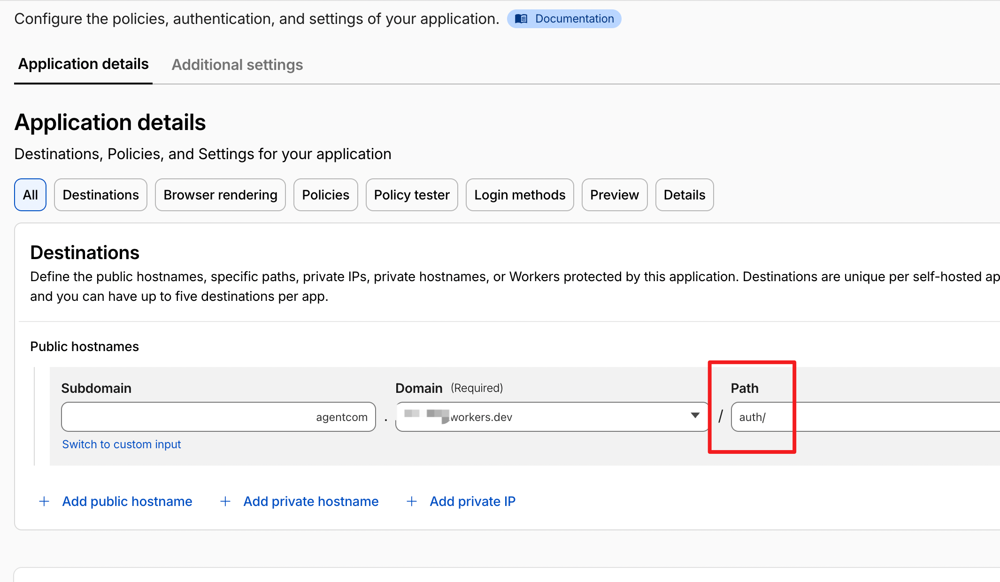
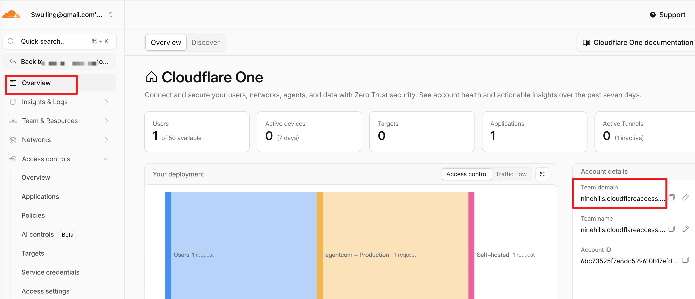
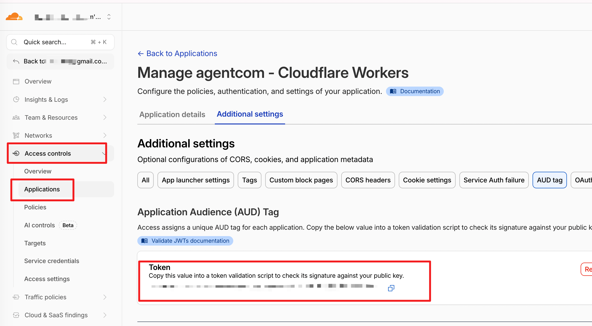

# agentcom

Remote 1:1 messaging between Pi sessions across machines.

agentcom gives every Pi session an address like `planner@imac` or `worker@macbook`, then lets users or agents list online sessions, send messages, ask for replies, and answer pending asks through `/com` or the `com` tool.

> [!NOTE]
> This README focuses on getting agentcom running. For Worker internals, tests, and deployment operations, see [`server/agentcom/README.md`](server/agentcom/README.md).

## What you can do

- **Message another machine** — send from `alice@imac` to `bob@macbook` over WebSocket.
- **Coordinate agents** — let one Pi session delegate, ask, or report back to another session.
- **Use human-gated device auth** — protect browser auth pages with Cloudflare Access, then connect Pi with short-lived device tokens.
- **Keep addresses readable** — target by session id, session name, or full `session-name@node-name` address.

## Prerequisites

- A Cloudflare account with Workers, Durable Objects, and Zero Trust Access.
  - Zero Trust Access may require a billing method, but agentcom fits within the free tier for typical personal/team use.
- Wrangler login:

  ```bash
  npm install
  npx wrangler whoami
  ```

- Pi installed on every machine that should join agentcom.

## 1. Configure and deploy the Worker

Create a production Worker config from the checked-in test config:

```bash
cp server/agentcom/wrangler.test.toml server/agentcom/wrangler.toml
```

Edit `server/agentcom/wrangler.toml`; at this point, keep the Cloudflare Access values as placeholders:

```toml
[vars]
TEAM_DOMAIN = "https://<your-team>.cloudflareaccess.com"
POLICY_AUD = "<Cloudflare Access Application Audience AUD Tag>"
```

Then set the token signing secret with Wrangler:

```bash
openssl rand -base64 32
npx wrangler secret put DEVICE_TOKEN_HMAC_SECRET --config server/agentcom/wrangler.toml
```

Deploy:

```bash
npx wrangler deploy --config server/agentcom/wrangler.toml
```

Your Worker base URL will look like:

```text
https://agentcom.<account>.workers.dev
```



## 2. Configure Cloudflare Access

Enable Cloudflare Access authentication for the Worker:



This may put `/ws` behind Access too, so adjust the application path.

Open the Zero Trust dashboard:



Set the path to `/auth/`, then click **Save** near the bottom:



Finally, find the Team domain and AUD tag from these two places:





Edit `server/agentcom/wrangler.toml` with the values:

```toml
[vars]
TEAM_DOMAIN = "https://<your-team>.cloudflareaccess.com"
POLICY_AUD = "<Cloudflare Access Application Audience AUD Tag>"
```

Then deploy again:

```bash
npx wrangler deploy --config server/agentcom/wrangler.toml

# Keep the printed Worker URL; you will need it in Pi.
```

Quick checks:

```bash
# Expected: 200
curl -i https://agentcom.<account>.workers.dev/
# Expected: 426
curl -i https://agentcom.<account>.workers.dev/ws
# Expected: 302 redirect to Cloudflare Access when not signed in
curl -i https://agentcom.<account>.workers.dev/auth/device
```

## 3. Install the Pi extension

Install agentcom as a Pi package on every machine that should participate:

```bash
# From Git, once the repository is available to your Pi environment
pi install git:github.com/ninehills/agentcom

# Or for local development
pi install /absolute/path/to/agentcom
```

Restart Pi after installing. The extension registers:

- `/com` command for users.
  - Run `/com` with no arguments to open the session picker and message compose panel.
- `com` tool for agents.

agentcom stores local config and device credentials under:

```text
~/.config/agentcom/config.json
~/.config/agentcom/credentials.json
```

## 4. Join a Worker from Pi

In a Pi session, start auth:

```text
/com auth
```

When prompted, enter the Worker base URL:

```text
https://agentcom.<account>.workers.dev
```

Open the shown `/auth/device` URL in your browser, sign in through Cloudflare Access, then copy the generated join command:

```text
/com join wss://agentcom.<account>.workers.dev/ws com_dev_...
```

Run it inside Pi. The session should report a joined node and session id.

Check status:

```text
/com status
```

Rename the current node if you want a stable, friendly address:

```text
/com rename imac
```

> [!TIP]
> Device tokens are short-lived and one-time use. After the first join, agentcom saves a device key locally and reconnects automatically on future Pi starts.

## 5. Send messages

Open Pi on two machines, join both to the same Worker, and optionally name the sessions:

```text
/name planner
/com rename imac
```

List online sessions:

```text
/com list
```

Or open the interactive panel and pick a target:

```text
/com
```

Example output:

```text
planner@imac id=s-0bkl2sm4 node=imac cwd=/repo runtime=pi status=idle model=openai/gpt-5
worker@macbook id=s-x8p2nq9a node=macbook cwd=/repo runtime=pi status=working model=openai/gpt-5
```

Send a fire-and-forget message:

```text
/com send worker@macbook Please check the failing auth test.
```

Ask and wait for a reply:

```text
/com ask planner@imac Should retry apply to POST requests too?
```

Reply to the latest pending ask:

```text
/com reply No, only idempotent requests.
```

If a short name is ambiguous, use the full address or session id:

```text
/com send s-x8p2nq9a Hello from the other machine.
```

## 6. Let agents use `com`

Agents can use the same channel through the registered tool:

```typescript
com({ action: "list" })

com({
  action: "send",
  to: "worker@macbook",
  message: "I found the root cause in packages/client/src/com-client.ts."
})

com({
  action: "ask",
  to: "planner@imac",
  message: "Can I change the command wording in README-zh.md as part of this task?"
})

com({ action: "pending" })
com({ action: "reply", message: "Approved." })
com({ action: "status" })
```

Use `send` for notifications and `ask` only when the sender needs the reply before continuing.

## 7. Manage devices

Open the device page from Pi:

```text
/com device
```

Or visit directly:

```text
https://agentcom.<account>.workers.dev/auth/devices
```

From there you can see registered devices, online sessions, and revoke devices that should no longer connect.

To remove the current local credential from Pi:

```text
/com leave
```
